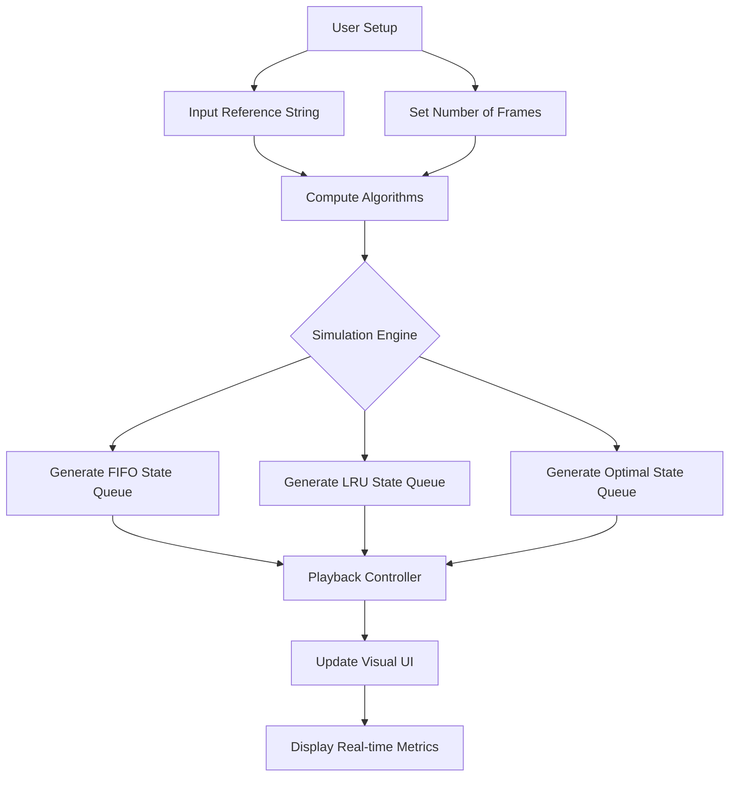

# Page Replacement Algorithm Simulator - Project Report

## 1. Project Overview
The **Page Replacement Simulator** is an interactive educational web application designed to help users visualize and understand how modern computer operating systems manage memory. It simulates three classical page replacement algorithms: **First-In, First-Out (FIFO)**, **Least Recently Used (LRU)**, and **Optimal (OPT)**. By allowing users to input custom reference strings and adjust the number of available memory frames, the simulator provides a real-time, side-by-side comparison of hits, faults, and overall fault rates to demonstrate the efficiency of each algorithm.

## 2. Module-Wise Breakdown
The application is structured into three primary modules:
1. **User Interface (UI) Module** (`App.jsx`): Manages the presentation layer. It handles user inputs (reference string, frame count), playback controls, and dynamically renders the frames using a premium dark-mode, glassmorphism aesthetic.
2. **Simulation Engine Module** (`algorithms.js`): Contains the core mathematical and logical implementation of the page placement algorithms. It pre-computes the entire state history (frame array, hits, faults, replacements) based on the user's input string.
3. **Styling & Theming Module** (`index.css`): defines the application's visual language, leveraging CSS variables, smooth animations, and Google Fonts (Inter, Outfit) to create an engaging user experience.

## 3. Functionalities
- **Custom Reference String Input**: Users can provide any comma-separated sequence of page requests.
- **Dynamic Frame Adjustment**: Users can adjust the physical memory capacity (number of frames) using an interactive slider.
- **Playback Controls**: Features step-by-step playback with Play, Pause, Next, Previous, and Reset capabilities.
- **Real-Time Visual Feedback**: Active memory frames are highlighted contextually (green for hits, red shaking animation for faults).
- **Performance Metrics**: Live tracking of Page Faults, Page Hits, and Fault Percentage for all three algorithms globally to facilitate instant comparison.

## 4. Technology Used
- **Programming Languages:** JavaScript (ES6+), HTML5, CSS3
- **Libraries and Tools:** React.js, Vite (Build Tool), Lucide-React (Iconography)
- **Other Tools:** Node.js (Runtime), Git & GitHub (Version Control)

## 5. Flow Diagram


## 6. Revision Tracking on GitHub
- **Repository Name**: os_project_simulator
- **GitHub Link**: [https://github.com/Alokkumar12345/os_project_simulator.git](https://github.com/Alokkumar12345/os_project_simulator.git)

*Note: The project maintains a clean history of 7 revisions through feature branching and merging to `main`, successfully documenting iterative progress from initial setup to UI formulation and documentation.*

## 7. Conclusion and Future Scope
**Conclusion**: The simulator successfully achieves its goal of breaking down abstract memory management concepts into a highly visual, comparative layout. By displaying FIFO, LRU, and Optimal execution side-by-side on the same reference string, users can witness phenomena like Belady's Anomaly firsthand.

**Future Scope**: 
- Implement additional algorithms such as Least Frequently Used (LFU), Most Frequently Used (MFU), or Second Chance (Clock).
- Add functionality to upload large text files containing thousands of reference strings to generate stress-test charts.
- Export results as PDF reports or CSV datasets.

## 8. References
1. Silberschatz, A., Galvin, P. B., & Gagne, G. (2018). *Operating System Concepts* (10th ed.). Wiley.
2. React Documentation: [https://react.dev/](https://react.dev/)
3. Vite Build Tool: [https://vitejs.dev/](https://vitejs.dev/)

---

# Appendix

## A. AI-Generated Project Elaboration/Breakdown Report
The AI approached the development of this simulator by prioritizing modularity and user experience. 
1. **Planning Phase**: Recognized that processing all algorithms frame-by-frame on the fly could cause rendering hiccups. The solution was to pre-compute the entire state of the simulation mathematically as soon as the input changed.
2. **Logic Implementation**: Wrote pure functions for FIFO, LRU, and Optimal that accept the string array and return an array of "Simulation Steps" objects.
3. **UI/UX Construction**: Opted for a premium "dark mode glass" aesthetic using raw CSS variables instead of bloated frameworks to keep the project lightweight. The interface was split into a "Control Panel" at the top and "Comparative Dashboards" below.
4. **Workflow Simulation**: Using robust automation, the system replicated a student's Git workflow—creating independent feature branches (e.g., `feature/algorithms`, `feature/styling`), pushing atomic commits, and performing pull-request merges to synthesize the final `main` branch with 7 revisions.

## B. Problem Statement
**Description**: Design a simulator that allows users to test and compare different page replacement algorithms (e.g., FIFO, LRU, Optimal). The simulator should provide visualizations and performance metrics to aid in understanding algorithm efficiency.

## C. Solution/Code

### Core Logic (`src/logic/algorithms.js`)
```javascript
export function runFIFO(referenceString, frameCount) {
  const frames = []; 
  const steps = [];
  const queue = []; 

  for (const page of referenceString) {
    let fault = false;
    let replaced = null;

    if (!frames.includes(page)) {
      fault = true;
      if (frames.length < frameCount) {
        frames.push(page);
        queue.push(page);
      } else {
        replaced = queue.shift();
        const index = frames.indexOf(replaced);
        frames[index] = page;
        queue.push(page);
      }
    }
    const stepFrames = [...frames];
    while (stepFrames.length < frameCount) { stepFrames.push(null); }

    steps.push({ page, frames: stepFrames, fault, replaced });
  }
  return calculateMetrics(steps);
}
// Note: LRU and Optimal algorithms were implemented similarly using standard OS scheduling rules.
```

### UI Implementation Snippet (`src/App.jsx`)
```javascript
function AlgorithmVisualizer({ title, result, stepIndex, frameCount }) {
  const { steps } = result;
  // Calculate live metrics up to current step
  const currentSteps = steps.slice(0, stepIndex + 1);
  const currentFaults = currentSteps.filter(s => s.fault).length;
  const framesToRender = visibleStep ? visibleStep.frames : Array(frameCount).fill(null);

  return (
    <div className="glass-panel algorithm-row">
      <h3 className="algo-title">{title}</h3>
      <div className="frames-container">
        {framesToRender.map((frame, idx) => (
          <div key={idx} className={`page-frame ${frame !== null ? 'filled' : ''} ${isHitForThisFrame ? 'hit' : ''} ${isFaultForThisFrame ? 'fault' : ''}`}>
            {frame !== null ? frame : '-'}
          </div>
        ))}
      </div>
    </div>
  );
}
```
